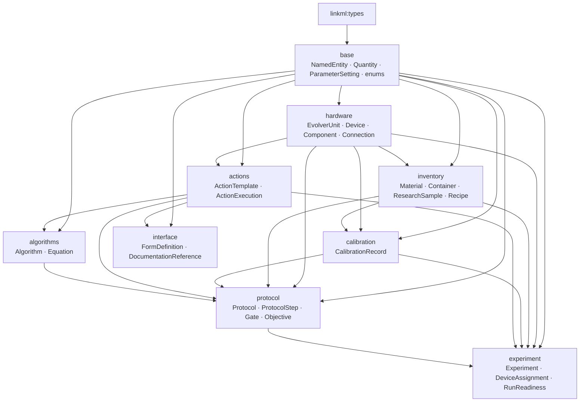
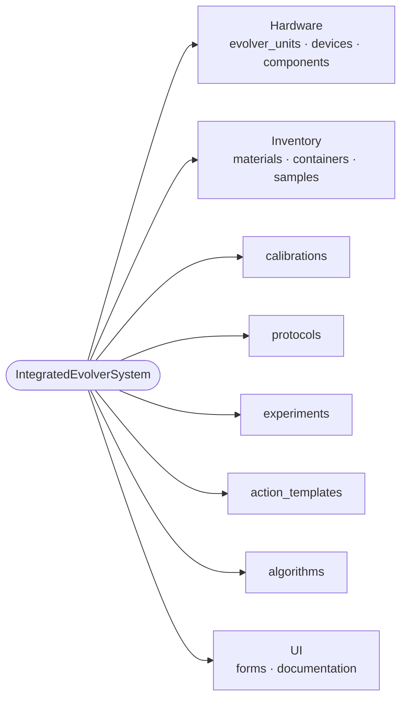
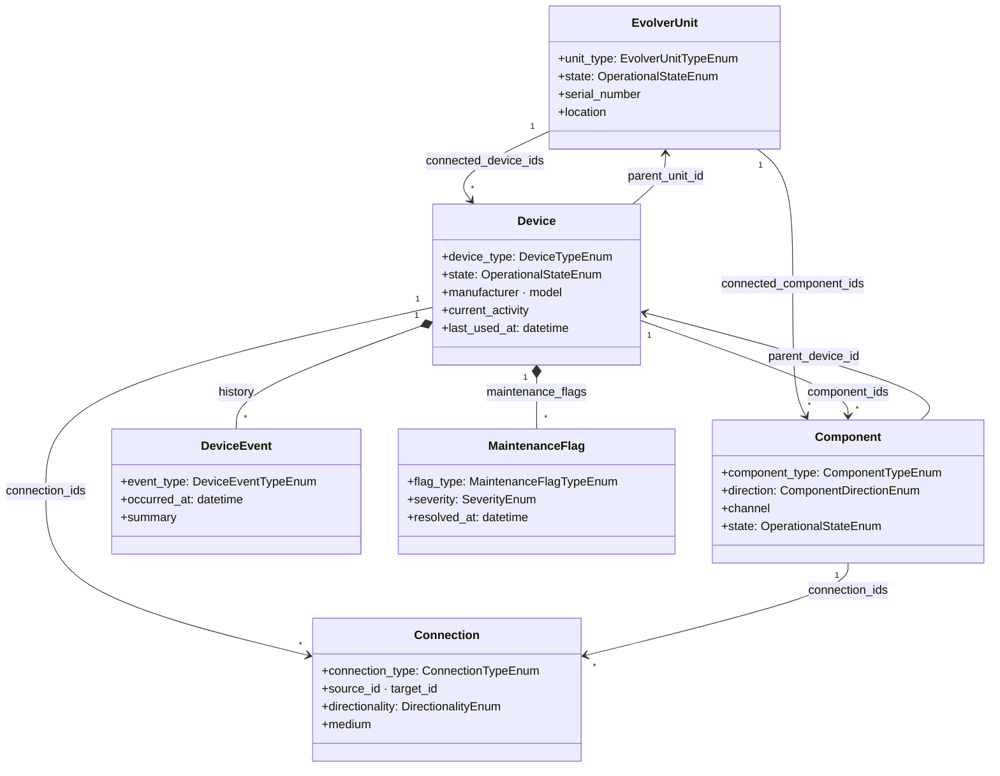
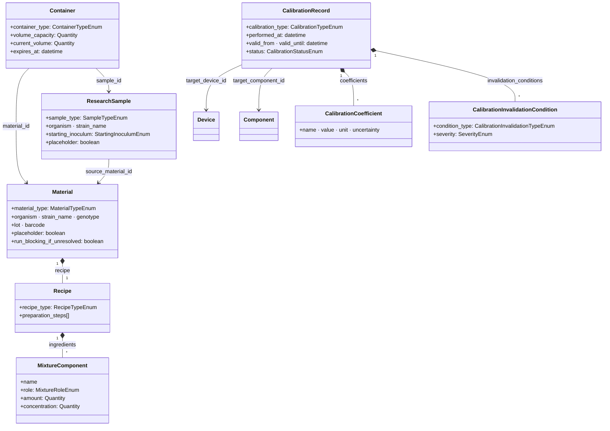
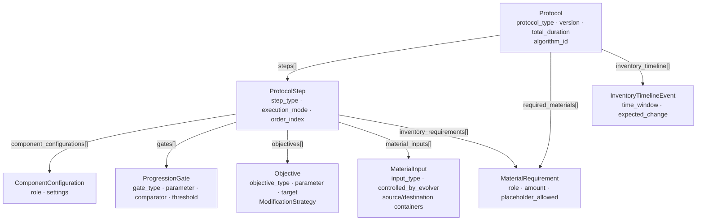
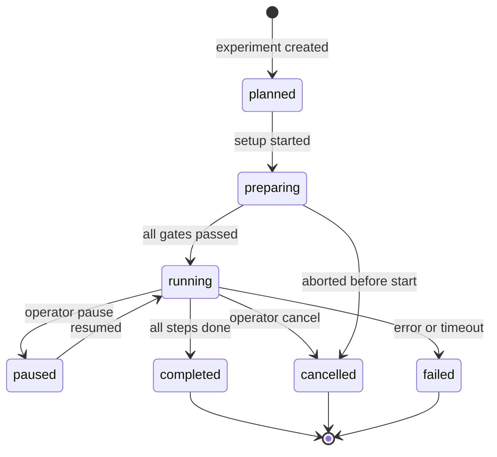
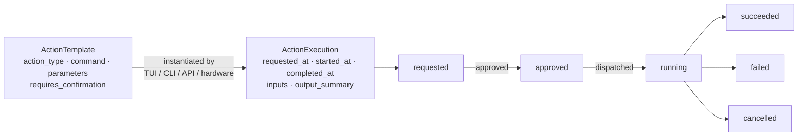

# Integrated eVOLVER System Schemas

This directory contains the project-owned schemas for the integrated eVOLVER
runtime and related tooling.

The external examples in `../known_external_examples` are references for
vocabulary and LinkML style only. They should not be treated as canonical for
this project because the integrated eVOLVER model needs operational concepts
that the plate/submission schemas do not cover: devices, components,
connections, calibrations, protocols, runtime actions, inventory timelines,
algorithms, forms, and contextual documentation references.

## Files

- `integrated_evolver_schema.linkml.yml`: root schema and tree-root container.
- `schemas/base.yaml`: shared entities, quantities, agents, and parameters.
- `schemas/hardware.yaml`: eVOLVER units, devices, components,
  connections, device events, and maintenance flags.
- `schemas/inventory.yaml`: materials, samples, containers, recipes,
  mixtures, storage, and expiration policy.
- `schemas/calibration.yaml`: temperature, OD, OD blank, pump, and
  invalidation-condition records.
- `schemas/actions.yaml`: action templates and action executions for
  TUI/CLI/API/hardware commands.
- `schemas/algorithms.yaml`: growth curve, chemostat, turbidostat, media
  requirement, and related equations.
- `schemas/protocol.yaml`: protocol templates, steps, gates, objectives,
  component configs, material inputs, and inventory timelines.
- `schemas/experiment.yaml`: concrete experiment runs, assignments,
  overrides, calibration references, and action logs.
- `schemas/interface.yaml`: documentation references and generated form
  definitions.
- `objects/software/tui/*.json`: project-owned TUI runtime object fixtures,
  action catalogs, form templates, and architecture metadata.
- `objects/demo_integrated_system.json`: canonical schema-shaped
  `IntegratedEvolverSystem` demo object graph used as the source for projected
  UI demo data.

## Modeling Direction

The schema is organized around a root `IntegratedEvolverSystem` document with
separate collections for physical inventory, hardware, protocols, experiments,
actions, algorithms, forms, and documentation references.

References between objects use IDs so the same material, calibration, device,
or action can be reused by multiple protocols and experiments.

Python code should eventually load and validate JSON/YAML documents against
these schemas instead of owning this structure directly.

## Diagrams

### Schema Module Dependencies

Each schema module imports only what it needs. The layering keeps lower-level
modules free of protocol/experiment knowledge.

### Root Document Collections

`IntegratedEvolverSystem` is the tree root. All other objects live in one of
its top-level lists and are cross-referenced by ID.

### Hardware Layer

`EvolverUnit` is the physical chassis. It owns `Device` records (sensors,
pumps, vials) which are composed of `Component` records (sensor channels,
pump ports, stir bars). `Connection` edges wire components together.

### Inventory and Calibration

`Material` and `ResearchSample` are the biological inputs. `Container` is
the physical vessel. `CalibrationRecord` ties sensor accuracy to a specific
device or component and carries invalidation conditions.

### Protocol Structure

A `Protocol` is a reusable template. Each `ProtocolStep` carries component
configurations, material inputs, progression gates (preconditions), and
objectives (control targets).

### Experiment Lifecycle

An `Experiment` is a concrete run of a `Protocol`. The `RunReadiness` block
gates launch on unresolved placeholder materials and devices.

### Action Template and Execution Flow

`ActionTemplate` is the reusable definition; `ActionExecution` is the
concrete dispatch record appended to the experiment's `action_log`.

