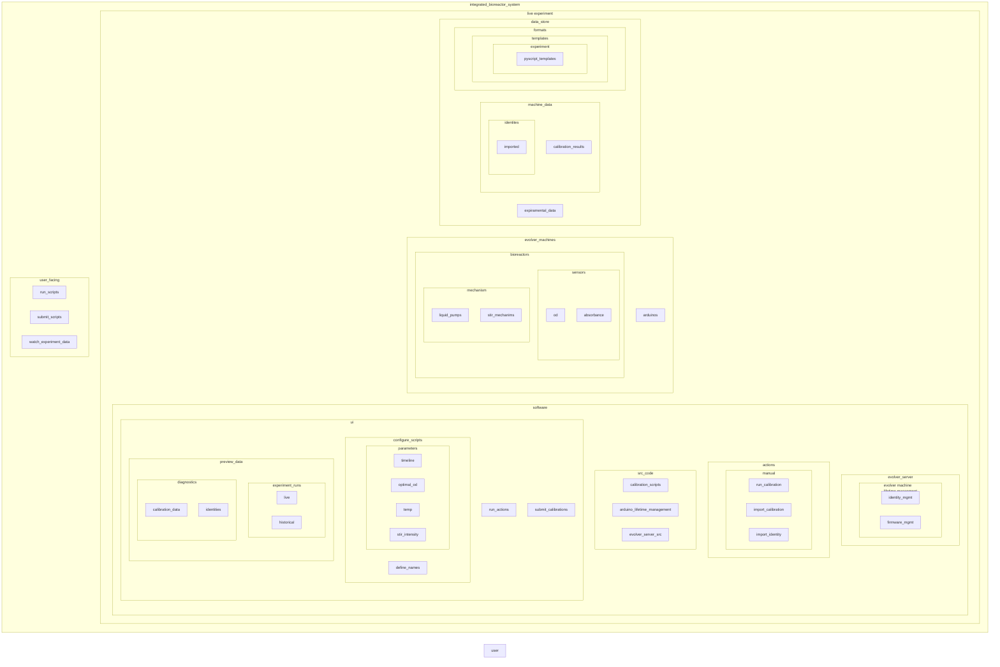

lets get the ui up and running, lets start with a tui,
  lets build it like lazygit where there are several smaller windows on the left, then
  main window on the right that shows active info basedon what isselected on the left,
  with a command log at the bottom of the right
  we can steal status directly - of like idle, machine errror, expirment name running,
  calibrating, permision needed, etc ---- then other bits that we need to manage, we
  - need a way to build experimt protocols through the forms,
  - live experiment status
    - like what step are we on, what is everythign activly doing, growth graph, eta/percent progress
    - name and meta data
  - need a way to view live machines and control them
  - permit and run enrolment
  - monitor live software procs

the lazygit style lends itself well to tree like aproaches, plus also shortcuts availible in specific scopes

we have blocks 1-5 on the left
block 0 is the displayon the right 

top of the tree:
1. status: block 1
    maybe a shortcut like space when focused on block 1 that brings you right to the relevant page calling for attention
2. experients 
    tab in block 2
    shows a list of experiments -active or -complete or -failed, -staged, since time order is most critical order by timeof start
        user can focus on that experiment by clicking or selecting with arrow keys, where block 0 will show the relavaent data, state, which evolver units are currently rquisitioned by this experiment, or in use by, total time/ progress etc
        shortcuts recomemended in bottombar:
            space - to switch to the experiament
            p to pause,
            c to cancle (will need popup to confirm)
            n to make new ( will prompt name)
            r to run ( warn if another experiment is currently running)
    user is focused on one out of how many experiments designated by the astrix
3. 
2. machines
    in block2
    list of the connected minievovlers, focosing on each shows info in block0
2. processes
    in block 2, shows a list of procs active in order of importance, and exposes keyboardshortcuts to manipulate them
    

