# eVOLVER Integrated Architecture — Design Presentation

> A visual reference for walking through the integrated eVOLVER runtime architecture.
> Scroll section by section. Each section is self-contained.

---

## 1. What Is eVOLVER?

eVOLVER is a **continuous-culture bioreactor platform** that lets researchers automate long-running microbial evolution experiments. Each machine houses an array of vials, each independently controlled for temperature, stir speed, optical density sensing, and fluid handling (pumps).

```
┌─────────────────────────────────────────────────────┐
│               eVOLVER Machine                       │
│                                                     │
│  ┌──────┐  ┌──────┐  ┌──────┐  ┌──────┐            │
│  │ vial │  │ vial │  │ vial │  │ vial │  … ×16     │
│  │  01  │  │  02  │  │  03  │  │  04  │            │
│  │  🌡  │  │  🌡  │  │  🌡  │  │  🌡  │  temp      │
│  │  💡  │  │  💡  │  │  💡  │  │  💡  │  OD        │
│  │  🌀  │  │  🌀  │  │  🌀  │  │  🌀  │  stir      │
│  │  💧  │  │  💧  │  │  💧  │  │  💧  │  pumps     │
│  └──────┘  └──────┘  └──────┘  └──────┘            │
│                                                     │
│  Arduino SAMD21 — serial I/O — Raspberry Pi         │
└─────────────────────────────────────────────────────┘
```

The Arduino handles real-time hardware I/O. The Raspberry Pi hosts the **eVOLVER server**, which talks to the Arduino over serial and exposes a Socket.IO API to computers on the network.

---

## 2. The Old Model: Server + DPU

The original architecture treats the system as two units:

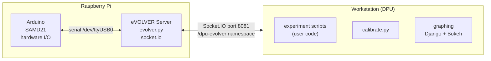

### What DPU actually contains

The label "DPU" is misleading — it hides at least five different concerns inside a single boundary:

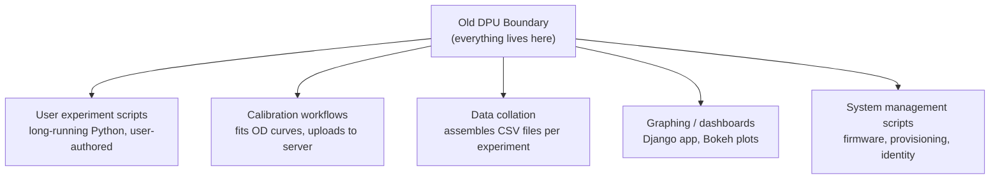

Those jobs have **different lifetimes and failure modes**. A bad graphing import should not kill an experiment. A bad experiment script should not take down data capture.

---

## 3. The Integrated Model — Big Picture

The transition changes the mental model from two blobs into **explicit bounded services**:

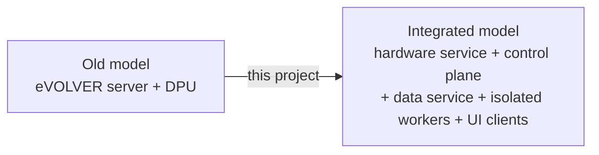

### New responsibility split

| Old label | New home |
|-----------|----------|
| Hardware I/O | `evolver-hardwared` |
| Experiment logic | isolated runner subprocess |
| Calibration, firmware, provisioning | one-shot maintenance workers |
| Data ingest + storage | `evolver-datad` |
| Graphing / visibility | visibility clients over data service |
| Operator CLI | `dpu` CLI/SDK |
| Operator console | TUI — `evolver-ui` |
| Remote sync | `evolver-syncd` |

---

## 4. Target Process Model

The supervisor owns the service tree. The control plane coordinates everything below it — but it never runs user code or one-shot maintenance operations inside its own process.

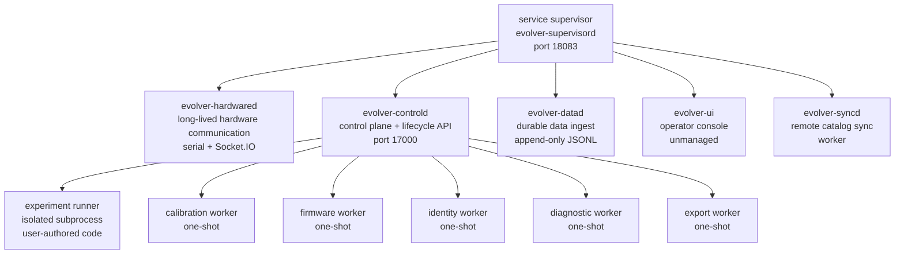

### Service catalog (current)

From `service_catalog.yaml`:

| ID | Name | Category | Purpose |
|----|------|----------|---------|
| `control-plane` | Control Plane | core | lifecycle coordinator, control API |
| `evolver-server` | eVOLVER Server | managed | legacy Socket.IO + serial server |
| `broadcast-ingest` | Broadcast Ingest | managed | persist raw broadcasts from server |
| `data-service` | Data Service | managed | local JSONL persistence |
| `tui` | TUI | unmanaged | operator terminal sessions |

---

## 5. Core Services — Deep Dive

### 5a. Hardware Service

The hardware service is the **highest-priority long-running process**. It owns the live relationship with every connected machine.

Responsibilities:
- Discover and identify connected machines (provisioning handshake)
- Maintain serial connections to the Arduino
- Read raw sensor signals every broadcast cycle (~20 s)
- Send validated hardware commands
- Track firmware and protocol compatibility
- Enforce exclusive hardware access

> **Key rule:** The hardware service owns the mechanism. The control plane owns the policy.

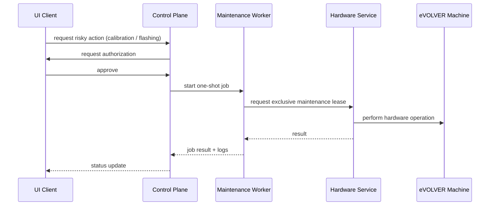

### 5b. Control Plane

The control plane is the **coordinator**. It manages experiment lifetimes, tracks authorization, supervises workers, and exposes the local HTTP API.

Current API surface (`control_api.py`):

```
GET  /health
GET  /experiments
POST /experiments
POST /experiments/{id}/start
POST /experiments/{id}/pause
POST /experiments/{id}/resume
POST /experiments/{id}/stop
POST /device-commands
GET  /jobs
GET  /services          ← proxies to supervisor
POST /services/{id}/{action}
```

**Experiment state machine:**

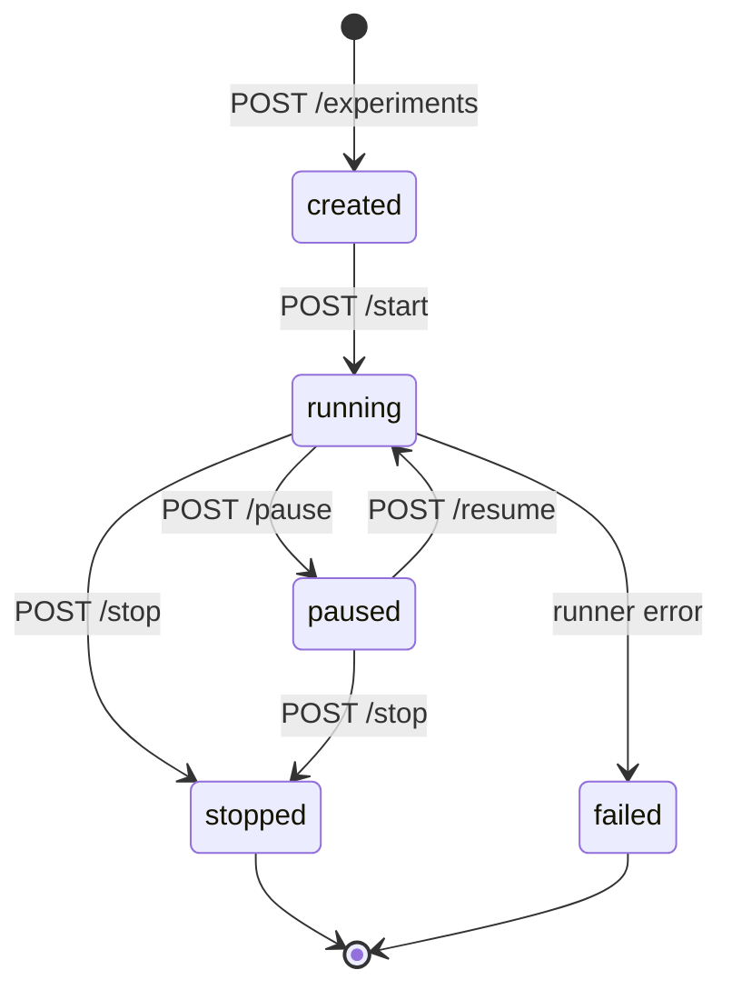

### 5c. Data Service

Raw data is persisted **before** experiment-specific processing. This protects data if an experiment script, UI, or control process fails.

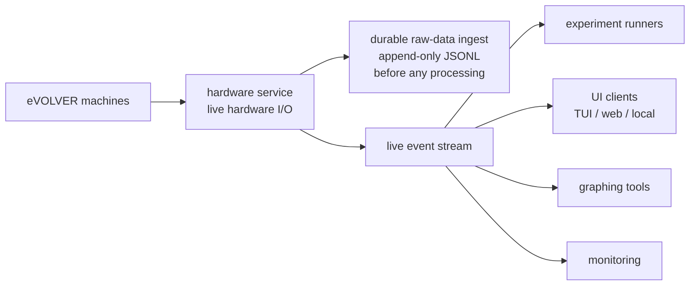

Dataset types managed by the data service:

| Dataset | Contents |
|---------|----------|
| Machine lifetime | identity history, firmware history, calibration history, maintenance records |
| Experiment session | raw measurements, transforms, actions, events, logs |
| User / customer | templates, preferences, saved configs, permissions |
| System config | schemas, validation rules, approved firmware, form definitions |

---

## 6. Message Contracts

All interprocess communication uses **versioned, validated envelopes**. This makes services independently evolvable without silent incompatibilities.

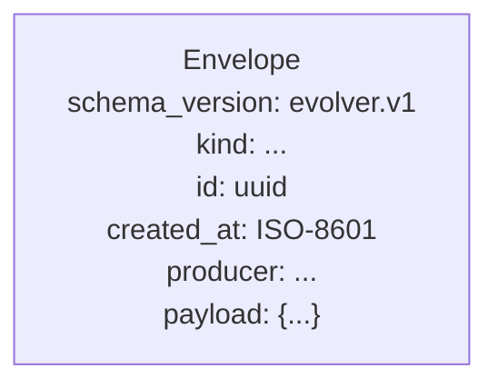

Named event kinds (`messages.py`):

| Kind | Direction | Purpose |
|------|-----------|---------|
| `machine.measurement.raw` | hardware → data service | raw sensor broadcast |
| `experiment.status` | control plane → subscribers | lifecycle transitions |
| `experiment.runner.action` | runner → control plane | control actions from user code |
| `job.status` | maintenance workers → control plane | one-shot job updates |
| `device.command.request` | control plane → hardware | validated hardware command |

**Device command shape** (backward-compatible with legacy DPU format):

```json
{
  "param": "temp",
  "value": ["NaN", "3001"],
  "immediate": true,
  "recurring": false,
  "fields_expected_outgoing": 17,
  "fields_expected_incoming": 17
}
```

---

## 7. Command Path and Data Path

### Command path (top-down)

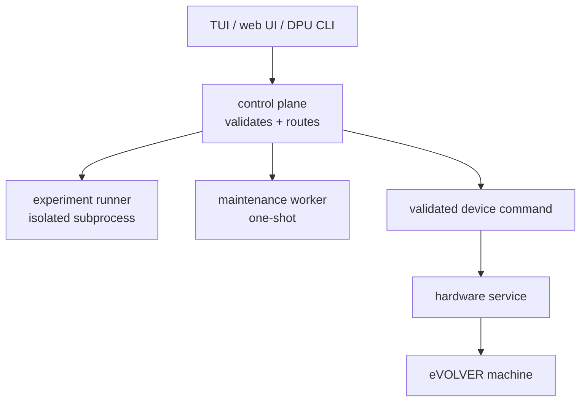

### Data path (bottom-up)

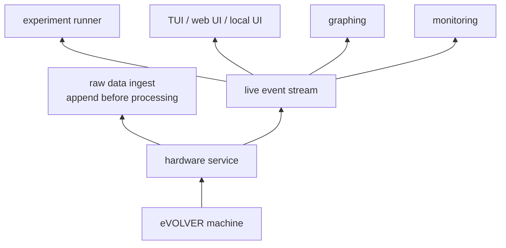

---

## 8. Failure Isolation

Because each concern runs in its own process, failures are **contained**:

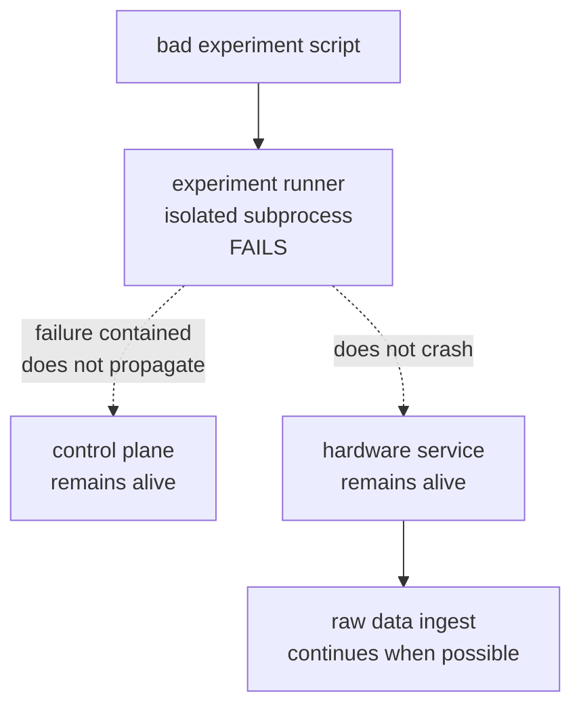

The same logic applies to maintenance workers. A firmware flash that crashes cannot take down the long-lived hardware communication loop.

---

## 9. Maintenance Authorization Flow

Risky operations require **explicit user authorization** before the control plane will launch a worker:

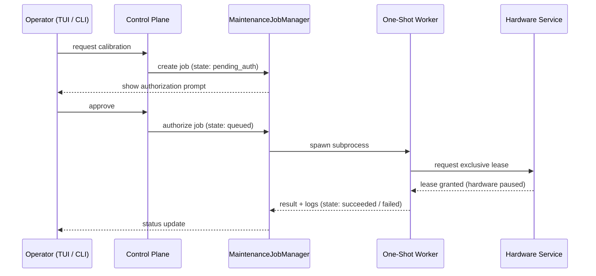

Operations that require authorization:
- Firmware flashing
- Calibration
- Identity replacement
- Machine reset
- Experiment interruption
- Destructive data operations

---

## 10. DPU — From System Boundary to Tool Layer

In the new model, the DPU becomes a **CLI client and experiment authoring SDK**, not the single place where orchestration, data, and hardware-adjacent jobs are mixed.

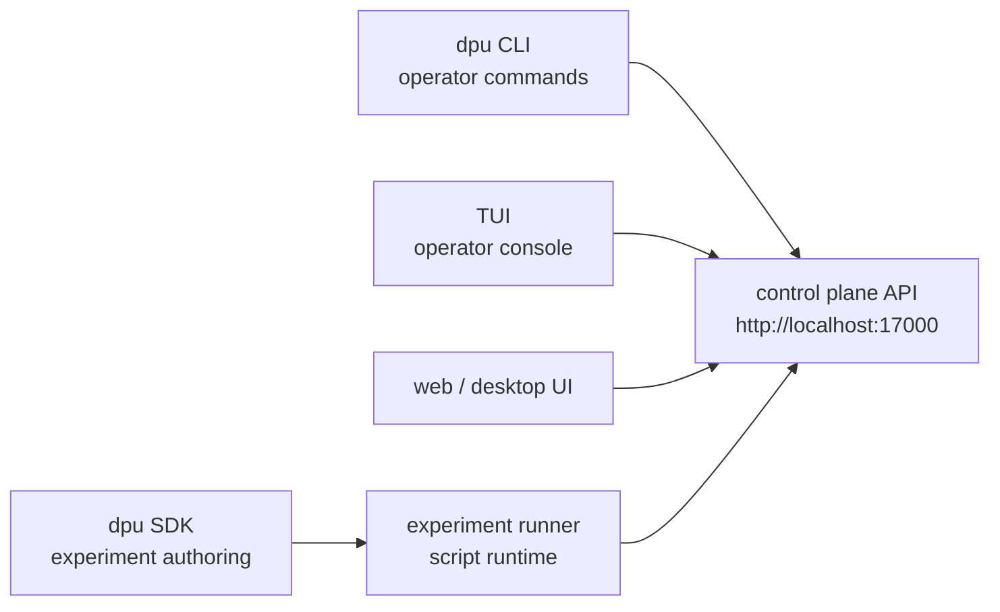

Example future CLI commands:

```bash
dpu status
dpu experiment create
dpu experiment start experiment.yml
dpu experiment pause EXP-123
dpu experiment resume EXP-123
dpu experiment stop EXP-123
dpu calibration start --device evo-01 --type od
dpu firmware install --device evo-01 firmware.bin
dpu data watch EXP-123
dpu data export EXP-123
```

---

## 11. Remote Sync

Remote synchronization runs as a **dedicated non-blocking worker**. Local operation is the authority while offline; sync state is tracked explicitly.

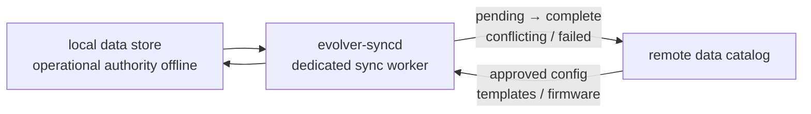

What the remote catalog can mirror:

- Machine lifetime datasets (for administrators)
- Experiment datasets (users + admins)
- User / customer datasets
- Shared configuration, templates, schemas, form definitions
- Approved firmware artifacts

---

## 12. The TUI — Operator Console

The TUI is built with **Textual** and models a lazygit-style operator console. All five left-column windows are **always visible together** in the main scope.

```
┌──────────────────────────────────────────────────────────────────────────────┐
│ eVOLVER Control                                                   13:37:00  │
├───────────────────────────────┬──────────────────────────────────────────────┤
│ [1] Status                    │ [Main Detail]                                │
│  supervisor  ok               │                                              │
│  control     ok               │  Selected experiment / service / protocol    │
│  hardware    unreachable      │  detail, health, recent events,              │
├───────────────────────────────┤  and next sensible actions.                  │
│ [2] Live                      │                                              │
│  Experiments | Units | Svcs   │                                              │
│  ○ trial-a        [created]   │                                              │
│  ◉ overnight-od   [running]   │                                              │
│  ✗ failed-test    [failed]    │                                              │
├───────────────────────────────┤                                              │
│ [3] Inventory                 │                                              │
│  Protocols | Materials | Devs │                                              │
│  ○ turbidostat       [6]      │                                              │
│  ○ morbidostat       [8]      │                                              │
├───────────────────────────────┤                                              │
│ [4] Steps — turbidostat       │                                              │
│  ● 1. inoculate               │                                              │
│  ◌ 2. grow to target OD       │                                              │
│  ○ 3. maintain dilution       │                                              │
├───────────────────────────────┼──────────────────────────────────────────────┤
│ [5] Components                │ [Command Log]                                │
│  pump-a      [liquid_mover]   │ 13:37:00  TUI started                        │
│  vial-03     [bioreactor]     │ 13:38:11  RESTART control-plane              │
│  od-sensor   [sensor]         │ 13:38:14  ERROR supervisor unreachable       │
└───────────────────────────────┴──────────────────────────────────────────────┘
```

### Window roles

| Window | Role |
|--------|------|
| **[1] Status** | Always-visible trust indicator — supervisor / control / hardware reachability |
| **[2] Live** | Active runtime objects — experiments, hardware units, managed services |
| **[3] Inventory** | Reusable definitions — protocols, materials, devices |
| **[4] Steps** | Ordered steps of the selected protocol or running experiment |
| **[5] Components** | Components bound to the selected protocol step |
| **Main Detail** | Full detail for whatever is selected — state, logs, actions |
| **Command Log** | Audit trail of operator actions and system responses |

### Service state symbols

| Symbol | Meaning |
|--------|---------|
| `○` green | running |
| `⏸` | paused |
| `□` dim | stopped / available |
| `■` red | cancelled |
| `✗` red | failed |
| `?` | unknown / unreachable |

### Key bindings (main scope)

| Key | Action |
|-----|--------|
| `1`–`5` | focus window (siblings stay visible) |
| `n` | new experiment (from [2] Live) |
| `r` | run / restart focused item |
| `p` | pause / resume |
| `c` | cancel / stop with confirmation |
| `s` / `x` | start / stop service |
| `enter` | open detail in Main |
| `/` | fuzzy-search current panel |
| `[` / `]` | switch tabs within a window |

---

## 13. Implementation Phases

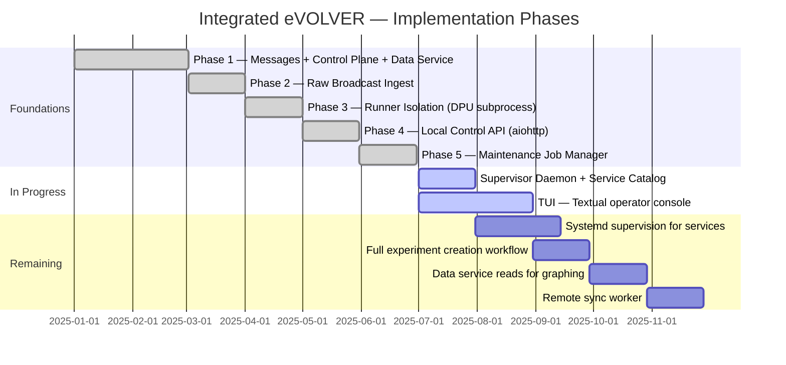

### Phase summary

| Phase | What was built | Module |
|-------|---------------|--------|
| 1 | Versioned message contracts, `LocalDataService`, `ControlPlane` lifecycle | `messages.py`, `data_service.py`, `control_plane.py` |
| 2 | `BroadcastIngestor` — Socket.IO → `machine.measurement.raw` | `broadcast_ingest.py` |
| 3 | `DpuRunnerManager` — DPU script as isolated subprocess | `runner_manager.py` |
| 4 | `create_control_plane_app` — aiohttp HTTP API | `control_api.py`, `control_daemon.py` |
| 5 | `MaintenanceJobManager` — one-shot jobs + authorization | `maintenance_jobs.py` |
| — | `ServiceManager`, `SupervisorDaemon`, service catalog | `service_manager.py`, `supervisor_daemon.py` |
| — | TUI — Textual app, panels, screens, supervisor client | `tui/` |

---

## 14. Design Rules

These rules define what the integrated architecture must always preserve:

1. **Only the hardware service owns normal hardware communication.**
2. **User code never runs inside the hardware service.**
3. **User experiment code never runs inside the control-plane process.**
4. **Maintenance jobs run as interruptible one-shot workers.**
5. **Raw data is persisted independently of experiment-specific processing.**
6. **Risky maintenance actions require explicit user authorization.**
7. **UI clients talk to the control plane — never directly to hardware.**
8. **All interprocess messages use versioned, validated formats (`evolver.v1`).**
9. **Graphing and visualization are visibility clients, not data owners.**
10. **Local operation continues when remote services are unavailable.**
11. **Data collation and management are independent from DPU experiment execution.**
12. **The DPU becomes a CLI and SDK layer over the integrated system.**

---

## 15. Full System View

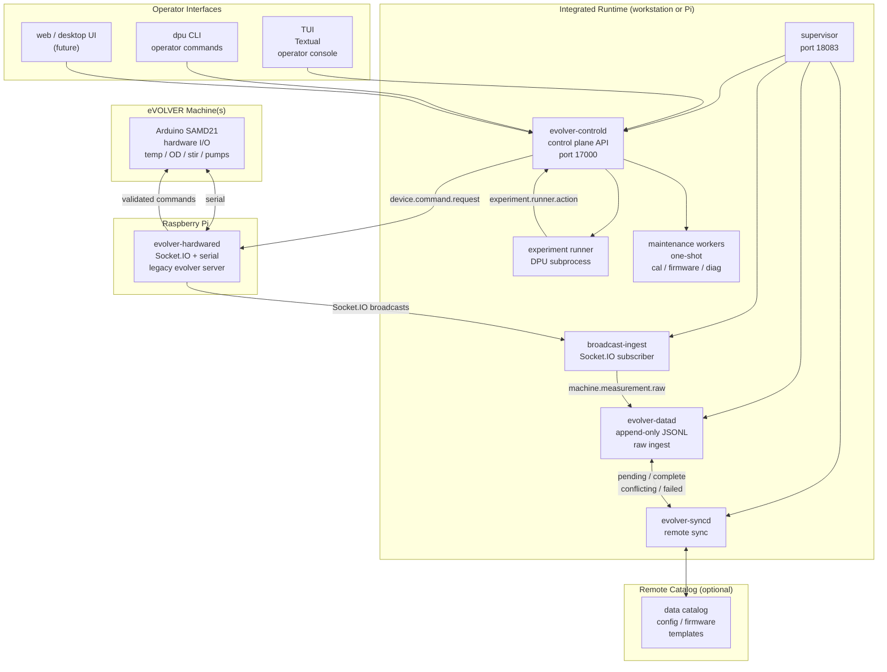

---

*End of presentation — all diagrams generated with Mermaid and render in any Markdown viewer that supports it (GitHub, VS Code preview, Obsidian, etc.).*
