# Transition From Server/DPU to Integrated eVOLVER Architecture

## Purpose

The current eVOLVER software model treats the eVOLVER server and the DPU as the
two primary system units. That split is useful historically, but it now hides
several different responsibilities inside the DPU name: experiment scripts,
data collation, data visualization, calibration helpers, local storage, and
operator-facing tools.

For an integrated local instrument, those responsibilities need clearer
boundaries. The goal is to support dedicated console-like eVOLVER installations
where users can run experiments, monitor machines, approve maintenance actions,
and review data without needing to understand command-line workflows, ports,
networking, or the internal process layout.

The proposed architecture changes the mental model from:

```text
eVOLVER server + DPU
```

to:

```text
hardware service + control plane + data service + isolated workers + UI clients
```

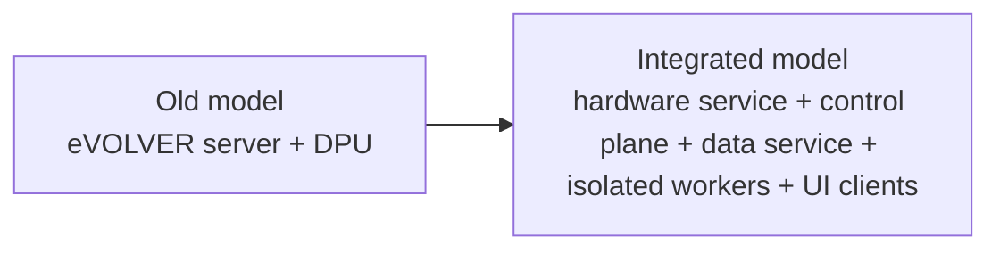

This keeps the reliable hardware communication path small and long-lived while
moving user workflows, one-shot maintenance jobs, data assembly, graphing, and
interactive controls into dedicated components.

## Why the Current DPU Boundary Should Change

The DPU should not remain a single architectural unit. It currently represents
too many different things:

- user-authored experiment logic
- internal system management scripts
- calibration and firmware workflows
- data processing and dataset assembly
- graphing and visibility tools
- command-line operator workflows

Those jobs have different lifetimes and failure modes. A graphing issue should
not affect experiment control. A bad user experiment script should not crash the
system supervisor. A calibration process should be interruptible without
endangering the long-lived server that owns hardware communication.

The better split is:

```text
External experiment scripts
    User-authored experiment logic, run in isolated subprocesses.

Internal maintenance scripts
    Calibration, firmware flashing, identity provisioning, diagnostics,
    and recovery jobs, run as one-shot workers.

Data service
    Durable ingestion, dataset assembly, local storage, and export.

Visibility tools
    Graphing, historical inspection, dashboards, and future UI views.

DPU CLI/SDK
    A command-line client and scripting interface, not the whole system.
```

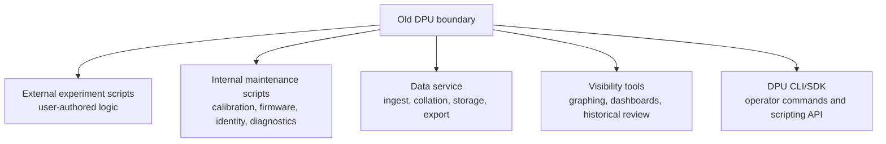

This preserves the useful parts of the DPU while preventing it from becoming a
large, ambiguous process that owns everything.

## Target Process Model

The integrated local system should be organized around explicit services:

```text
service supervisor
├── evolver-hardwared
├── evolver-controld
├── evolver-datad
├── evolver-ui
└── evolver-syncd

evolver-controld
├── experiment runner processes
├── calibration workers
├── firmware workers
├── identity provisioning workers
├── diagnostic workers
└── export workers
```

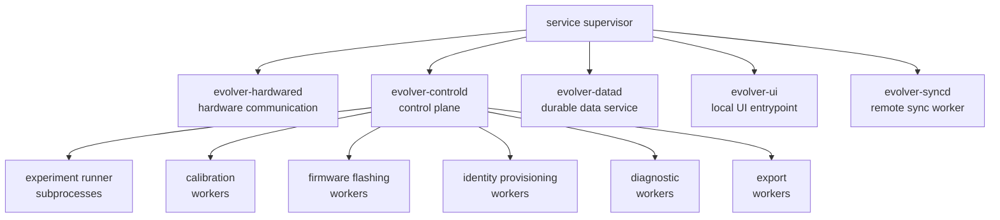

The supervisor keeps the core services alive. The control plane coordinates the
system, but it should not personally execute user experiment code or one-shot
maintenance procedures inside its own process.

## Core Services

### Hardware Service

The hardware service is the long-running eVOLVER server role. Its continuity is
the highest priority because it owns the live relationship with the connected
machines.

It is responsible for:

- discovering connected machines
- maintaining serial or hardware connections
- reading raw machine signals
- sending validated hardware commands
- tracking current machine state
- managing machine identity
- tracking firmware and protocol compatibility
- exposing live machine data
- enforcing exclusive hardware access
- reporting hardware and communication failures

The hardware service owns the mechanism for hardware operations, but it should
not independently decide when risky operations are allowed.

For example, it can provide controlled ways to flash firmware, calibrate
devices, or provision identity, but those operations must be requested and
authorized through the control plane.

The rule is:

```text
The hardware service owns hardware access.
The control plane and user authorization own operational policy.
```

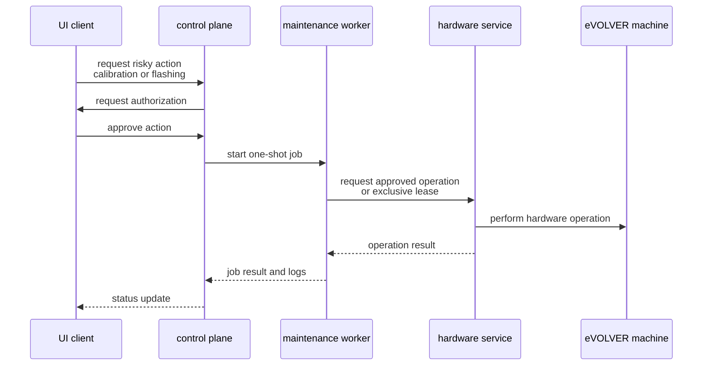

### Control Plane

The control plane is the main coordinator for the integrated setup. It manages
experiment lifetimes, supervises worker processes, exposes an API for UI clients,
and coordinates requests that affect hardware.

It is responsible for:

- monitoring the hardware service
- starting, stopping, and restarting managed workers
- exposing system status
- managing experiment lifecycle state
- validating experiment requests
- routing approved device commands to the hardware service
- launching isolated experiment runners
- launching one-shot maintenance jobs
- tracking authorization requests
- reporting errors and job status to UI clients

The control plane is the right place to define standard action formats between
components. Those formats should be versioned and validated so that experiment
runners, UI clients, maintenance jobs, and services can evolve without silently
becoming incompatible.

### Data Service

Data collation and data management should be separated from the DPU and from
experiment execution.

The data service receives machine events and persists durable records. Raw
measurements should be saved before experiment-specific processing whenever
practical. This protects the system from data loss if an experiment script, UI,
or control process fails.

The safer data flow is:

```text
eVOLVER machines
        |
        v
hardware service
        |
        +----> durable raw-data ingest
        |
        +----> live event stream
                    |
                    +----> experiment runners
                    +----> UI clients
                    +----> graphing tools
                    +----> monitoring
```

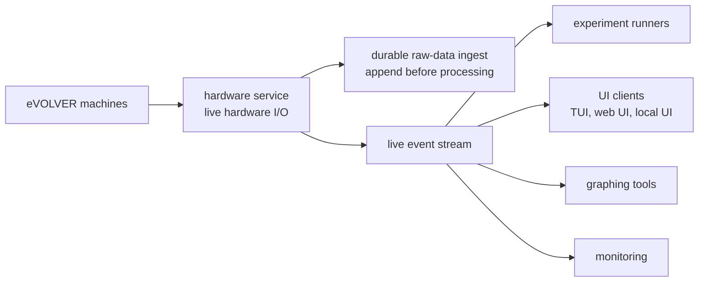

The data service should assemble:

- machine-lifetime datasets
- experiment-session datasets
- user or customer datasets
- system logs
- derived datasets and exports

Graphing tools, including existing tools such as
`/home/ash/Documents/work/evolver_code/dpu/graphing`, should become visibility
clients over the data service or standardized exports rather than direct owners
of experiment data.

### UI Clients

The user interface is an overlay on top of the control plane. It should not
communicate directly with hardware or bypass the system policy layer.

Supported UI forms can include:

- web UI
- terminal UI
- local desktop UI
- command-line DPU client

All of these should be clients of the same control-plane API.

The TUI being planned in a lazygit-like style is a strong first step because it
can expose the integrated system without requiring a full web application. It
can show live status, active experiments, protocol steps, bioreactors, software
processes, command logs, and permission requests in one operator-focused
console.

The long-term UI responsibility is to make the system approachable for users who
are less familiar with command-line operation. The UI should guide the user
through experiment setup, live monitoring, maintenance approval, and data review
without exposing internal scripts as the primary workflow.

## Experiment Execution

User experiment scripts should run as isolated subprocesses, not inside the
hardware service and not inside the control plane.

Each experiment runner should receive:

- an experiment identifier
- selected machine and vial identifiers
- validated experiment configuration
- access to the relevant live data stream
- a restricted command interface
- a dedicated output location
- pause, resume, cancel, and interrupt signals

Each runner should produce:

- calculated values
- requested control actions
- derived measurements
- status updates
- warnings
- errors
- logs
- final results

The control plane validates requested hardware actions before forwarding them to
the hardware service.

This gives the system a clear failure boundary:

```text
Bad experiment script -> runner process fails
Bad experiment script -> control plane remains alive
Bad experiment script -> hardware service remains alive
Raw data ingest continues whenever possible
```

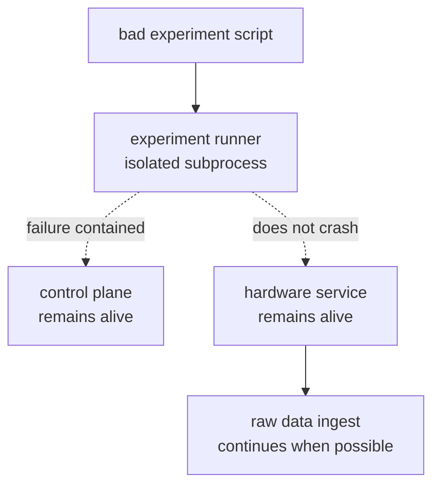

## Maintenance Jobs

Maintenance scripts should also be isolated one-shot processes. Firmware
flashing, calibration, identity provisioning, diagnostics, and recovery may need
to be interrupted, retried, or run with special permissions.

They should not be embedded into the long-lived hardware service process.

Instead, the control plane should launch and supervise maintenance workers:

```text
control plane
    |
    +----> calibration worker
    +----> firmware flashing worker
    +----> identity provisioning worker
    +----> diagnostic worker
```

Workers should either send approved commands through the hardware service or
request an exclusive maintenance lease that causes the hardware service to
deliberately release the device while the maintenance operation runs.

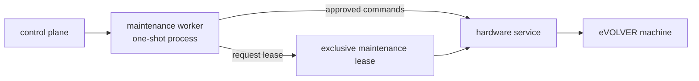

Risky operations should require explicit authorization. Examples include:

- firmware flashing
- calibration
- identity replacement
- machine reset
- experiment interruption
- destructive data operations

## DPU as a Tool, Not the System Boundary

The DPU can become a real command-line tool and SDK for users and developers,
while the integrated services provide the stable runtime.

Example future commands:

```bash
dpu status
dpu experiment create
dpu experiment start experiment.yml
dpu experiment pause EXP-123
dpu experiment resume EXP-123
dpu experiment stop EXP-123
dpu calibration start --device evo-01 --type od
dpu firmware install --device evo-01 firmware.bin
dpu data watch EXP-123
dpu data export EXP-123
```

In this model, the DPU CLI is a client of the control plane, just like the TUI
or web UI. The DPU SDK helps authors write experiment scripts against stable
input and output formats.

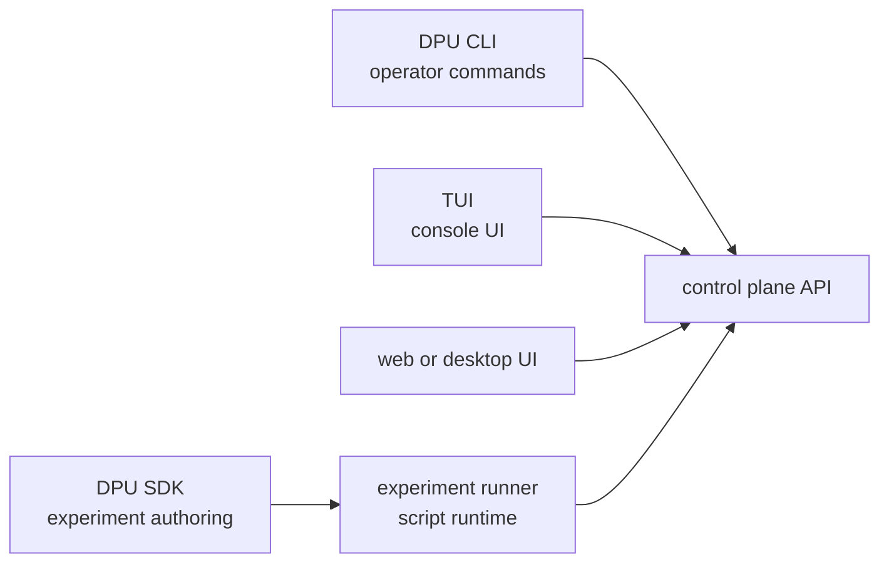

The important distinction is that DPU becomes an interface and developer
tooling layer, not the single place where orchestration, data management,
visualization, and hardware-adjacent jobs are mixed together.

## Local Data Store

The local data store should support offline operation and dedicated console
installs. Remote services should be useful, but not required for active machine
operation.

### Machine Lifetime Data

Machine lifetime data is primarily administrative and should track:

- machine identity
- hardware identity history
- firmware history
- calibration history
- maintenance records
- diagnostic records
- communication failures
- historical machine state
- administrative logs

A machine or tightly coupled machine cluster may have one lifetime dataset.

### Experiment Session Data

Each experiment should have one session dataset containing:

- raw measurements associated with the experiment
- transformed measurements
- derived metrics
- experiment configuration
- experiment metadata
- control actions
- user actions
- start, pause, resume, stop, and recovery events
- warnings, errors, and logs

### User or Customer Data

Each user or customer scope may contain:

- user metadata
- experiment templates
- saved configurations
- preferred forms
- export preferences
- permissions

### System Configuration

System configuration storage should contain:

- approved firmware artifacts
- experiment templates
- schema definitions
- data formats
- form definitions
- validation rules
- service configuration
- compatibility information

## Remote Data and Catalog Synchronization

Remote synchronization should be handled by a dedicated worker. It should not
block hardware communication, local experiment execution, or local data capture.

The remote catalog may mirror:

- machine lifetime datasets for administrators
- experiment datasets for users and administrators
- user or customer datasets
- shared configuration datasets
- approved firmware
- templates
- metadata schemas
- data schemas
- form definitions

The exact mirroring policy should be configurable. Local storage remains the
operational authority while offline. Synchronization records should track
whether remote copies are pending, complete, conflicting, or failed.

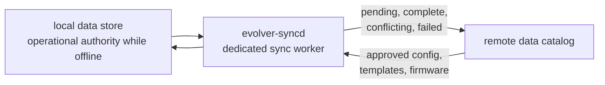

## Command and Data Paths

The command path should look like:

```text
TUI, web UI, local app, or DPU CLI
        |
        v
control plane
        |
        +----> experiment runner
        |
        +----> maintenance worker
        |
        +----> validated device command
                         |
                         v
                  hardware service
                         |
                         v
                  eVOLVER machine
```

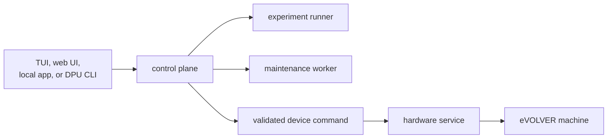

The data path should look like:

```text
eVOLVER machine
        |
        v
hardware service
        |
        +----> raw data service
        |
        +----> live event stream
                    |
                    +----> experiment runner
                    +----> TUI / web UI / local UI
                    +----> graphing
                    +----> monitoring
```

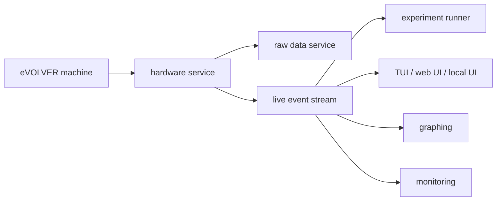

## How This Supports a Simpler User Experience

This architecture supports a dedicated integrated instrument rather than a
collection of scripts that require expert operation.

For less command-line-oriented users, the system can present:

- one local console entrypoint
- clear system status
- visible active experiments
- guided experiment configuration forms
- live graphs and machine state
- explicit approval prompts for risky actions
- readable errors and recovery paths
- historical experiment access
- admin-only maintenance controls

The lazygit-style TUI fits this direction because it can make the running system
visible immediately:

- status and alerts on the left
- active experiments and protocols in navigable panes
- bioreactor state in a dedicated pane
- process health and job status in a dedicated pane
- detailed view and command log on the right
- contextual shortcuts based on the focused pane

That TUI can later coexist with a web UI or local desktop UI because the
important boundary is the control-plane API, not the specific presentation.

## Design Rules

1. Only the hardware service owns normal hardware communication.
2. User code never runs inside the hardware service.
3. User experiment code never runs inside the control-plane process.
4. Maintenance jobs run as interruptible one-shot workers.
5. Raw data is persisted independently of experiment-specific processing.
6. Risky maintenance actions require explicit authorization.
7. UI clients talk to the control plane, not directly to hardware.
8. All interprocess messages use versioned, validated formats.
9. Graphing and visualization are visibility clients, not data owners.
10. Local operation continues when remote services are unavailable.
11. Data collation and management are independent from DPU experiment execution.
12. The DPU becomes a CLI and SDK layer over the integrated system.

## Recommended Naming

Use names that keep responsibilities clear:

- `evolver-hardwared`: long-lived hardware communication service
- `evolver-controld`: control plane and orchestration service
- `evolver-datad`: durable ingest, local storage, and dataset assembly service
- `evolver-ui`: UI service or local UI entrypoint
- `evolver-syncd`: remote synchronization worker
- `dpu`: command-line client and experiment scripting SDK

This prevents the new architecture from recreating the old DPU problem under a
different name. The control plane coordinates the system, but it should not
become the place where every concern is implemented.
